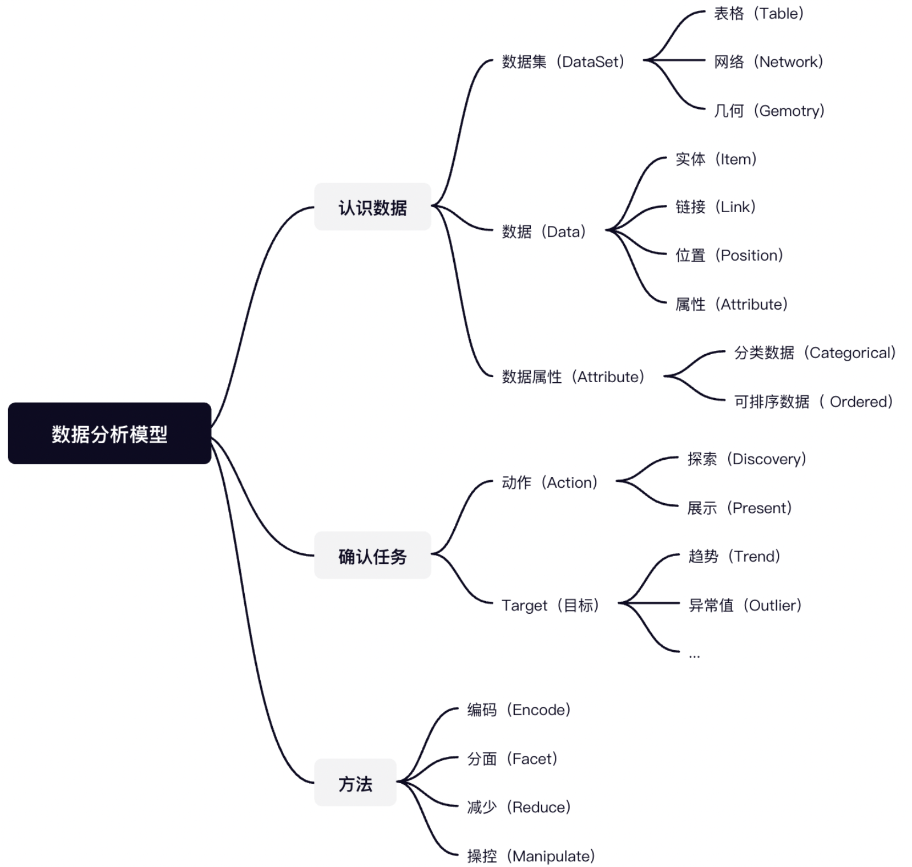

# 可视化入门：从 0 到 1 开发一个图表库

## Author

- **万木**：蚂蚁体验技术部前端工程师，AntV G2 栈的核心维护者，多次在 IEEE Vast Challenge，ChinaVis Challenge 等数据分析挑战赛中获得优异成绩。喜欢写代码给自己带来的创造的快乐，开源爱好者，在 [GitHub](https://link.juejin.cn/?target=https%3A%2F%2Fgithub.com%2Fpearmini) 有一些简单有意思的项目。
- **逍为**：蚂蚁体验技术部 / 数智团队前端开发，前网易游戏测试开发。目前主要负责内部 BI 产品 DeepInsight 的迭代，以及 AntV 开源统计图表 G2 技术栈的研发。 [GitHub](https://link.juejin.cn/?target=https%3A%2F%2Fgithub.com%2Fhustcc) 上开源了诸多有趣可用的开源项目。
- **新茗**：蚂蚁体验技术部前端工程师，AntV 核心开发者，负责开源统计图表 G2、G2Plot 的研发，以及蚂蚁集团 BI 产品 DeepInsight 的迭代，从图表库到 BI 产品的一体化建设，对商业智能领域的数据可视化建设有较丰富经验。
- **福晋**：蚂蚁体验技术部前端工程师，AntV 核心开发者，从事可视分析相关业务以及可视化基建，负责过多个大型项目的前端交付，擅长小程序、可视化、H5、RN 等领域。
- **云极**：蚂蚁体验技术部/数智团队，主要从事于 BI 产品地理数据可视分析前端研发。曾混迹于 GIS 数字孪生应用创业公司，主要负责 WebGIS 研发工程师的前端架构研发。技术兴趣爱好广泛并热心技术分享，目前沉迷于可视化与 Golang 方向。
- **缨缨**：蚂蚁体验技术部前端工程师，负责蚂蚁集团 BI 产品 DeepInsight 表相关业务迭代。AntV 核心开发者，AntV S2 技术栈负责人。

## Introduction

- [D3](https://link.juejin.cn/?target=https%3A%2F%2Fgithub.com%2Fd3%2Fd3)、[ECharts](https://link.juejin.cn/?target=https%3A%2F%2Fecharts.apache.org%2Fzh%2Findex.html)、[G2](https://link.juejin.cn/?target=https%3A%2F%2Fg2.antv.vision%2Fzh)、[Vega](https://link.juejin.cn/?target=https%3A%2F%2Fgithub.com%2Fvega%2Fvega)、[Vega-lite](https://link.juejin.cn/?target=https%3A%2F%2Fgithub.com%2Fvega%2Fvega-lite) 都可以做可视化，到底选择哪个？
- D3 学习曲线那么高，怎么入门？
- ECharts 和 G2 一个是配置式的 API，一个是函数式 API，到底有哪些区别？

网络上的教程尤其青睐将实践部分的数据渲染、性能优化等问题讲得透透彻彻，却又忽略了数据转换在数据可视化流程举足轻重的地位。就比如我们在开发迭代 G2 的过程中，也发现用户们有许多的问题。

- Quantile，Threshold，Quantize 比例尺有啥区别？
- 希望生成的坐标刻度是 6 个，但是为什么却生成了 8 个？
- nice 操作到底有什么用？

首先你会学到 Tamara Munzner 的 《Visualization Analysis & Design》这本书中如下的一个**数据分析的模型**，并且用它去完成完成“苏菲的世界”中可视化的设计。这里需要注意的因为小册子的篇幅有限，下面的内容不会深入讲解，只会讨论大部分相对重要一点的，剩余的简单提及。

- 了解数据可视化的流程；
- 知道怎么基于浏览器的 Canvas 和 SVG 绘图技术绘制条形图；
- 掌握图形语法，利用它去简化绘图流程；
- 从 0 到 1 开发一个基于图形语法的图表库：[Sparrow](https://link.juejin.cn/?target=https%3A%2F%2Fgithub.com%2Fsparrow-vis%2Fsparrow)；
- 知道如何让一个图表库从 0 到 1，也知道怎么让它 1 再到 2。